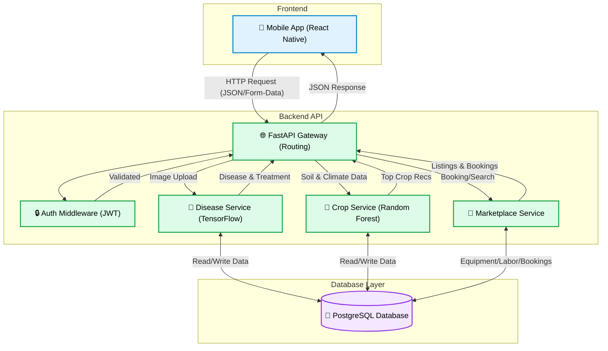

# 🌾 Safal Fasal

## 🌟 Introduction

**Smart Agriculture System** is an intelligent, production-ready mobile application designed to empower farmers, agronomists, and agricultural enthusiasts by putting sophisticated agricultural science right in their pockets. 

### 🎯 The Problem Being Addressed

Modern farming faces numerous challenges such as volatile weather, complex soil nutrient management, and devastating crop diseases. Traditional methods of diagnosing plant diseases or determining the optimal crop for a specific piece of land often rely on trial-and-error, manual inspection, or expensive consultation. This lack of immediate, data-driven agricultural intelligence often leads to suboptimal crop yields, pesticide misuse, and significant financial losses for farmers.

This project addresses these challenges by bridging the gap between cutting-edge Artificial Intelligence and everyday farming. Our app transforms an ordinary smartphone into a powerful agronomic tool, providing highly accessible, localized, and deeply accurate insights to help farmers maximize their yield, restore crop health, and optimize environmental resources.

### ✨ What The Project Is Doing

The platform utilizes custom-trained Machine Learning models alongside real-time data pipelines to offer:
- **Instant Disease Diagnosis:** Analyzes user-uploaded leaf images to detect plant diseases with over 96% accuracy and provides actionable, step-by-step treatment plans.
- **Intelligent Crop Recommendation:** Analyzes local soil properties (N, P, K, pH) and climate metrics to predict the best-suited, highest-yielding crops for a given plot of land.
- **Weather Intelligence:** Delivers crucial localized weather tracking and forecasting so farmers can preemptively manage their fields against adverse climate conditions.

### 📦 Key Dependencies

- **Frontend (Mobile Application):** React Native (Expo), TypeScript, React Navigation, Axios.
- **Backend API & Processing:** Python 3.9+, FastAPI, Uvicorn, Pydantic, SQLAlchemy.
- **Machine Learning Layer:** TensorFlow / Keras (Image Classification), Scikit-Learn (Random Forest), Pandas, NumPy.
- **Data & DevOps:** PostgreSQL, Docker, Docker-Compose.

### 🔌 APIs & Integrations

- **Internal API Layer:** Communication between the mobile app and backend utilizes a custom RESTful API structured via OpenAPI/Swagger.
- **External Weather API:** Integrates with third-party meteorological APIs (such as OpenWeatherMap) to fetch and render real-time local weather data, humidity, and forecasted rainfall directly onto the user's dashboard.

---
## 🚀 Key Services & Features

The project is broken down into modular services, ensuring clean abstraction between the API layer and the core processing logic:

1. **User Authentication Service** (`/auth`)
   - Manages user registrations and log in flows securely.
   - Provides JWT-based authentication to secure the inner agricultural tools.
2. **Plant Disease Detection Service** (`/disease`)
   - **How it works:** Users capture or upload an image of a plant/leaf. The app sends the image to the backend which utilizes a trained machine learning model (Accuracy: **95.6729%**) to detect potential diseases.
   - **Output:** Returns the identified disease, confidence level, associated symptoms, and a comprehensive treatment or prevention plan.
3. **Crop Recommendation Service** (`/crops`)
   - **How it works:** Users input their soil nutrient values (Nitrogen, Phosphorous, Potassium), soil pH level, temperature, humidity, and rainfall. 
   - **Output:** The service utilizes a trained **Random Forest** model (Accuracy: **99.8%**) via `crop_service.py` to analyze these parameters and recommends the top suitable crops optimized for the specified environment.
4. **Weather Intelligence Service** (`/weather`)
   - Real-time weather viewing and forecasting capabilities to help farmers anticipate changing conditions.
5. **Equipment & Labor Marketplace** (`/marketplace`)
   - **Rent Equipment:** Browse and rent tractors, harvesters, drones, sprayers, tillers, seeders, and other agricultural tools from nearby owners.
   - **Hire Labor:** Find and hire skilled farm workers filtered by skills (planting, harvesting, spraying, irrigation, etc.), location, experience, and ratings.
   - **Book Services:** Book equipment or labor directly from the app with automatic cost estimation. Track all bookings with status updates (pending → confirmed → completed).
   - **Reviews & Ratings:** Leave and view ratings for equipment and labor providers to help the community make informed decisions.
   - **Seed Data:** Comes pre-loaded with sample equipment and labor listings across major Indian agricultural regions for demonstration.

## 🏗 App Architecture & How It Works

The Smart Agriculture System operates on a modern, decoupled client-server architecture. This design cleanly separates the user interface from the heavy data processing and machine learning inference, allowing each component to scale independently.

### 🔄 End-to-End Data Flow



Here is a step-by-step breakdown of how the application functions behind the scenes:

1. **User Interaction (Client Side):**
   - The user interacts with the React Native mobile application (e.g., taking a photo of a diseased leaf or entering soil parameters).
   - The mobile application's UI components trigger actions that collect this data.

2. **Network Request:**
   - The app uses its internal API connector (`mobile/src/services/api.ts`) to format the user's data and securely send it over HTTP to the backend server.
   - For images, the app handles `multipart/form-data` uploads; for crop/weather data, it sends standard `JSON` payloads.

3. **API Routing & Validation (Server Side):**
   - The **FastAPI** backend receives the incoming request.
   - The request is first intercepted by authentication middleware to ensure the user has a valid JWT token.
   - The data is then strictly validated using **Pydantic** schemas (`backend/app/schemas/`) to prevent malformed data from causing internal server errors.

4. **Service Execution & Machine Learning Inference:**
   - Validated data is passed to the core business logic (`backend/app/services/`).
   - **Disease Detection Flow:** The `disease_service.py` takes the image bytes, preprocesses them to match the required dimensions of the ML model, and runs inference. It then maps the output class to a comprehensive database of diseases, symptoms, and treatments.
   - **Crop Recommendation Flow:** The `crop_service.py` feeds the tabular soil/climate data into a trained Random Forest model, which computes the probabilities of various crops and returns the top recommendations.

5. **Data Persistence (Database):**
   - If the operation requires saving user history (e.g., logging a previous scan), the backend uses **SQLAlchemy** to convert the Python objects into SQL queries.
   - These records are seamlessly stored in the **PostgreSQL** database instance.

6. **Response & GUI Update:**
   - The backend packages the inference results into a structured JSON response and sends it back to the mobile application.
   - The React Native app receives the response, updates its internal state, and dynamically renders the results to the user (e.g., displaying the disease name, symptoms, and treatment plan).

### 🛠 Comprehensive Technology Stack

- **Mobile Application (Frontend / Client)**
  - **Framework:** React Native with Expo.
  - **Language:** TypeScript for type-safe code.
  - **Routing:** React Navigation.
  - **Networking:** Axios for handling HTTP communication.
- **Backend API Server (Backend / Server)**
  - **Framework:** FastAPI (Python 3.9+).
  - **Data Validation:** Pydantic.
  - **ORM (Object Relational Mapper):** SQLAlchemy.
  - **AI / Machine Learning:** Custom trained models (TensorFlow/Scikit-Learn) deployed for real-time inference.
- **Data Layer (Database)**
  - **Relational DB:** PostgreSQL.
  - **Containerization:** Docker & Docker Compose for rapid ecosystem provisioning.

## 📂 Project Structure

```text
.
├── backend/                           # Fast API Python backend
│   ├── app/
│   │   ├── api/api_v1/endpoints/      # API Controllers
│   │   │   ├── auth.py                # Authentication endpoints
│   │   │   ├── disease.py             # Disease detection endpoints
│   │   │   ├── crops.py               # Crop recommendation endpoints
│   │   │   ├── weather.py             # Weather intelligence endpoints
│   │   │   └── marketplace.py         # 🆕 Equipment & Labor Marketplace endpoints
│   │   ├── core/                      # Configs & security logic
│   │   ├── db/                        # PostgreSQL DB session & setup
│   │   ├── models/                    # SQLAlchemy DB Models
│   │   │   ├── user.py                # User model
│   │   │   └── marketplace.py         # 🆕 Equipment, LaborProvider, Booking, Review models
│   │   ├── schemas/                   # Pydantic schemas for request/response validation
│   │   │   ├── auth.py, crop.py, ...  # Existing schemas
│   │   │   └── marketplace.py         # 🆕 Marketplace request/response schemas
│   │   └── services/                  # Core Business Logic
│   │       ├── disease_service.py     # Disease detection ML inference
│   │       ├── crop_service.py        # Crop recommendation ML inference
│   │       └── marketplace_service.py # 🆕 Marketplace CRUD, booking, reviews, seed data
│   ├── main.py                        # FastAPI application entry point
│   └── requirements.txt               # Python package dependencies
├── mobile/                            # React Native App
│   ├── src/
│   │   ├── components/                # Reusable UI components
│   │   ├── navigation/                # React Navigation routing
│   │   ├── screens/                   # Distinct mobile app pages
│   │   │   ├── HomeScreen.tsx         # Dashboard with feature cards
│   │   │   ├── DiseaseScreen.tsx      # Disease detection screen
│   │   │   ├── CropRecommendationScreen.tsx
│   │   │   ├── WeatherScreen.tsx      # Weather intelligence screen
│   │   │   └── MarketplaceScreen.tsx  # 🆕 Equipment & Labor Marketplace screen
│   │   ├── services/                  # Network configuration and API connectors
│   │   │   ├── api.ts                 # Base Axios instance
│   │   │   ├── featureService.ts      # Disease, crop, weather API calls
│   │   │   └── marketplaceService.ts  # 🆕 Marketplace API calls
│   │   ├── theme/                     # Styling variables
│   │   └── types/                     # TypeScript shared interfaces
│   └── package.json                   # JS/TS dependencies
└── docker-compose.yml                 # Database provisioning
```

## 🛠 Local Setup & Running Instructions

Follow these steps to clone the repository and run all services locally on your machine.

### Prerequisites
- [Node.js & npm](https://nodejs.org/en/) installed.
- [Python 3.9+](https://www.python.org/) installed.
- [Docker Desktop](https://www.docker.com/products/docker-desktop/) installed and running.
- **Expo Go** app installed on your physical smartphone (available on App Store / Play Store).

### Step 1: Start the Database Container
The application relies on PostgreSQL to store user and application data.

Open your terminal in the root directory and run:
```bash
docker-compose up -d
```
*This fetches the `postgres:15-alpine` image and starts the database instance mapping to your local port 5432.*

### Step 2: Spin Up the Backend Server
Open a new terminal session, navigate to the `backend` directory, and follow these commands:

```bash
cd backend

# Create a virtual environment (Recommended)
python -m venv venv

# Activate the virtual environment
# On macOS/Linux:
source venv/bin/activate
# On Windows:
# venv\Scripts\activate

# Install the Python dependencies
pip install -r requirements.txt

# Start the FastAPI web server
uvicorn app.main:app --reload
```
Once started, the backend API will run on `http://localhost:8000`. 
**Tip:** You can view the auto-generated Swagger documentation and test endpoints directly at `http://localhost:8000/docs`.

### Step 3: Launch the Mobile Application
Open *yet another* terminal session and configure the mobile app.

```bash
cd mobile

# Install JavaScript/TypeScript dependencies
npm install

# Start the Expo development server
npx expo start
```
After the server initializes, you will see a QR code in the terminal.
- **Testing on Physical Device**: Scan the QR code using the **Expo Go** application on your smartphone. (Ensure your phone and laptop are on the same WiFi network).
  - *Note: If running on a physical device, ensure you update `mobile/src/services/api.ts` to utilize your computer's local IPv4 address instead of `localhost`.*
- **Testing on Emulator**: Simply press `a` (for Android) or `i` (for iOS) in the terminal to launch the virtual device, provided you have Android Studio/Xcode properly configured.

## 🤝 Roadmap & Contribution
- Expand the dataset for the **Plant Disease Detection** model to support a wider array of crops and localized diseases.
- Integrate real-time edge inference directly on the mobile device utilizing **TensorFlow Lite** for offline operability.
- ✅ **Equipment & Labor Marketplace** — Rent tractors, harvesters, tools, hire labor, and book services directly from the app.
- Add **location-based proximity search** for marketplace listings using GPS coordinates.
- Implement **in-app chat** between equipment owners, labor providers, and farmers.
- Integrate **payment gateway** (Razorpay/UPI) for secure in-app transactions.
